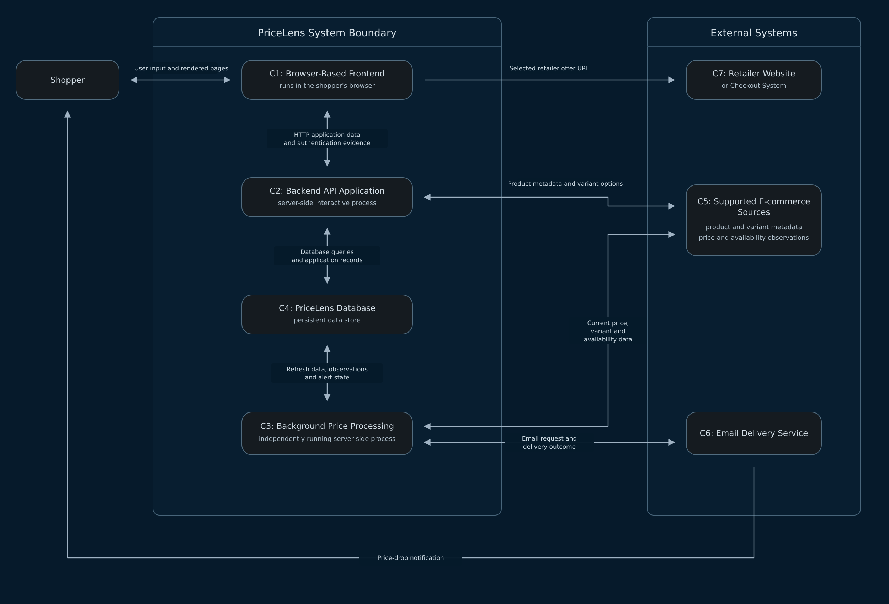

# PriceLens Design Document

## 1. Architecture

### 1.1 Architectural Drivers

The PriceLens architecture is driven by the approved Milestone 1 requirements and the Milestone 2 requirement to demonstrate a database-backed walking skeleton. These drivers define the capabilities and constraints that materially affect the system structure.

| ID | Architectural driver | Requirement source | Architectural implication |
|---|---|---|---|
| *AD1* | PriceLens must provide browser-based access while protecting user-specific data. | Scenarios 1–3; Section 6 — Screens and Flow | A browser frontend and backend authentication boundary are required. Every protected operation must enforce record ownership. |
| *AD2* | A shopper must be able to track a supported product by URL without creating a duplicate watchlist record. | US04; BR6 | The backend must validate and normalise URLs, check per-user uniqueness and persist accepted tracking data. |
| *AD3* | Tracking and comparison must preserve the exact selected product variant. | US09; US11; BR5 | Products, variants, retailer offers and tracked records require explicit relationships. Comparison logic must exclude mismatched variants. |
| *AD4* | Price data must support current-price, history, freshness and availability results. | US02; US06; US10; US12; BR3; BR8 | The system must retain timestamped price observations and availability data and support time-based queries. |
| *AD5* | Price alerts must enforce fixed limits and generate non-repeating threshold notifications. | US03; US05; US07; BR1; BR2; BR4 | Alert validation and notification state require authoritative backend logic and persistent data. |
| *AD6* | Confirmed product removal must preserve database consistency. | US08; BR7 | The tracked product and its dependent alerts must be removed in one controlled operation. |
| *AD7* | PriceLens supports selected e-commerce sources rather than every marketplace. | Product Vision; US04 | Source-specific acquisition logic must be isolated behind adapters, and invalid source data must not become valid observations. |
| *AD8* | Business Rules must produce the same result for user requests and background processing. | BR1–BR8 | Shared domain logic must remain independent of screens, jobs and external adapters. |
| *AD9* | Sprint 2 must prove a real page-to-database path. | Milestone 2 walking-skeleton requirement | One browser route must call the backend, read at least 10 seeded database records and render the returned data. |
| *AD10* | Configuration and secrets must remain outside committed source code. | Milestone 2 setup requirements | Environment-specific values must be documented in .env.example; real credentials must not be committed. |

The primary architectural priorities are requirement traceability, data integrity, separation of responsibilities, testability and incremental delivery. The walking skeleton proves the selected structure without requiring implementation of every approved User Story.

### 1.2 System Boundary

PriceLens owns the browser frontend, backend API, background price processing and database. It authenticates existing shoppers, manages user-owned tracking data, stores supported price information and enforces BR1–BR8. It does not sell products, control retailer inventory or complete purchases.

#### 1.2.1 Responsibilities Inside the Boundary

| Responsibility area | PriceLens responsibility |
|---|---|
| *Access control* | Authenticate an existing shopper, protect user-only operations, enforce record ownership and terminate authenticated state on sign-out. |
| *Product tracking* | Validate and normalise supported URLs, prevent per-user duplicates and preserve the selected product variant. |
| *Price data* | Store valid observations and provide current-price, 30-day history, freshness, availability and CSV-export data. |
| *Comparison* | Compare only equivalent variants and identify the lowest matching in-stock offer. |
| *Alerts* | Validate target prices, enforce the active-alert limit, maintain alert state and record qualifying notification events. |
| *External coordination* | Obtain supported product data through source adapters and request email delivery through an email adapter. |
| *Persistence* | Store users, catalogue data, tracked products, observations, alerts and notification records in PostgreSQL. |

#### 1.2.2 External Actors and Systems

| External element | Responsibility outside PriceLens |
|---|---|
| *Shopper* | Signs in, tracks products, inspects price information, compares offers and manages alerts. |
| *Browser and user device* | Provide the runtime environment used to access the PriceLens frontend. |
| *Supported e-commerce sources* | Publish product, variant, price, availability and retailer-link data consumed by supported integrations. |
| *Email delivery service* | Delivers notification messages requested by PriceLens. |
| *Retailer website or checkout system* | Allows the shopper to inspect an offer and independently complete a purchase after leaving PriceLens. |

The frontend belongs to PriceLens even though it runs in the shopper's browser. The device, browser software, network, retailer systems and email infrastructure remain outside the system boundary.

#### 1.2.3 Authentication and Data Ownership

Guests may access only the landing and sign-in path. Watchlist, product, comparison and alert operations require authenticated state. User is the ownership root for tracked products; alerts and notifications inherit ownership through their parent records. Each protected backend operation must resolve the authenticated user and restrict its query or mutation to records owned by that user.

Sprint 2 requires minimum authentication for existing users and at least one demonstration account. Registration, password recovery, social sign-in, multi-factor authentication, profile management and administrator account management remain outside the current milestone.

#### 1.2.4 Scope Exclusions and Open Decisions

PriceLens does not process payments, delivery, returns or refunds; guarantee support for every source; control external prices or inventory; or define administrator behaviour not approved in Milestone 1.

The following implementation choices remain for the relevant Architecture Decision Records:

- Authentication mechanism, session representation and credential-storage library.
- Frontend and backend frameworks.
- Background-job triggering mechanism.
- Source-specific acquisition methods.
- Email provider and delivery protocol.
- Physical deployment arrangement for PostgreSQL and the application components.
### 1.3 Components and Responsibilities

PriceLens uses a client-server architecture with separate frontend and backend applications. The frontend communicates with the backend through documented HTTP interfaces and does not access the database or external-service credentials directly.

#### 1.3.1 Component Inventory

| ID | Component | Runtime and ownership | Primary responsibility | Interfaces |
|---|---|---|---|---|
| *C1* | Browser-Based Frontend | PriceLens; shopper's browser | Presents screens, collects input and renders backend results. | HTTP with C2; external navigation to C7. |
| *C2* | Backend API | PriceLens; server process | Authenticates users, enforces ownership and domain rules, handles interactive operations and returns API responses. | HTTP with C1; database operations with C4; source-adapter calls to C5. |
| *C3* | Background Price Processor | PriceLens; independent server process | Refreshes prices and availability, stores observations, evaluates active alerts and requests notification delivery. | Database operations with C4; source-adapter calls to C5; email-adapter calls to C6. |
| *C4* | PostgreSQL Database | PriceLens; persistent data store | Stores application records and applies the constraints defined in Section 2. | Database-driver operations from C2 and C3. |
| *C5* | Supported E-commerce Sources | External | Supply supported product, variant, price and availability data. | Source-specific exchanges with adapters used by C2 and C3. |
| *C6* | Email Delivery Service | External | Delivers price-drop messages and returns delivery outcomes. | Delivery requests from C3. |
| *C7* | Retailer Website or Checkout System | External | Allows independent inspection and purchase of an offer. | Navigation from C1 through a retailer URL. |

C1, C2 and C4 form the required walking-skeleton path. C3 belongs to the target architecture but is not required to execute in the minimum Sprint 2 slice.

#### 1.3.2 Backend Modules

| Module | Responsibility | Related requirements |
|---|---|---|
| *API and Request Handling* | Parse HTTP requests and map application outcomes to JSON, file responses and status codes. | Section 3; US12 |
| *Authentication and Access Control* | Resolve authenticated identity, protect operations and enforce ownership. | Scenarios 1–3; protected screens |
| *Product Tracking* | Search tracked products, normalise URLs, preserve variants and coordinate confirmed deletion. | US01, US04, US08, US11; BR5–BR7 |
| *Pricing and Comparison* | Query price history, derive freshness and compare eligible matching offers. | US02, US06, US09, US10, US12; BR3, BR5, BR8 |
| *Alert and Notification* | Validate alerts, enforce active-count limits and evaluate threshold state. | US03, US05, US07; BR1, BR2, BR4 |
| *Persistence and Adapters* | Provide database transactions and isolate source-specific or email-provider communication. | Section 2; supported external integrations |

Request handlers, jobs and adapters coordinate inputs and outputs but do not define Business Rules. C2 and C3 reuse the applicable domain and persistence modules without making direct runtime calls to each other.

#### 1.3.3 Dependency Rules

1. C1 communicates with C2 only through documented HTTP contracts.
2. C2 and C3 are the only components permitted to access C4.
3. C2 and C3 invoke shared domain and persistence modules rather than duplicating Business Rules.
4. C2 accesses C5 only for interactive product registration; C3 accesses C5 for recurring observations.
5. Only C3 submits notification-delivery requests to C6.
6. External systems cannot read or modify C4 directly.
7. Server-side ownership and Business Rules remain authoritative even when C1 performs equivalent validation.

### 1.4 Communication Flows

#### 1.4.1 Component Communication

| Source | Destination | Interface | Data transferred |
|---|---|---|---|
| Shopper | C1 | User-interface interaction | Credentials, URLs, variants, search terms, target prices and confirmations. |
| C1 | C2 | HTTP request | Authentication evidence and application commands or queries. |
| C2 | C1 | HTTP response | JSON data, structured errors or a CSV file. |
| C2 | C4 | PostgreSQL queries and transactions | Users, ownership, tracked products, offers, observations and alerts. |
| C2 | C5 | Source-adapter request and result | Normalised URL, product metadata and available variants. |
| C3 | C4 | PostgreSQL queries and transactions | Refresh candidates, observations, alert state and notification records. |
| C3 | C5 | Source-adapter request and result | Source identifier, exact variant, price, currency, availability and observation time. |
| C3 | C6 | Email-adapter request and result | Recipient, subject, notification content and delivery outcome. |
| C1 | C7 | HTTPS navigation | Selected retailer-offer URL. |

#### 1.4.2 Interactive Request Flow

1. C1 sends an HTTP request to C2 and includes authentication evidence for a protected operation.
2. C2 resolves the authenticated user and applies ownership restrictions.
3. C2 validates the request through the appropriate domain module.
4. When product metadata or variant discovery is required, C2 uses the matching C5 adapter.
5. C2 reads or updates C4 within the required transaction boundary.
6. C2 returns JSON, a structured error or a CSV response for C1 to present.

A malformed URL, unsupported source, per-user duplicate, missing required variant or failed source acquisition does not create a tracked-product record.

#### 1.4.3 Background Price and Notification Flow

1. C3 selects tracked offers requiring refresh and requests current data through the relevant C5 adapter.
2. C3 validates the returned variant, price, currency, availability and observation time.
3. C3 records a valid observation in C4; failed or malformed results do not replace successful price data.
4. C3 derives the current price from the latest valid in-stock observations for the matching variant and currency.
5. C3 evaluates active alerts against the previous and newly derived current prices and records any qualifying BR4 event.
6. C3 requests delivery from C6 and stores the delivery outcome without treating a failed delivery as successful.
### 1.5 Container Architecture Diagram



C1, C2, C3 and C4 are inside the PriceLens system boundary; C5, C6 and C7 are external. Every connector in the diagram identifies both its direction and the data or protocol that crosses the boundary. The diagram presents container-level structure, while Sections 1.3 and 1.4 define responsibilities and flows.

### 2.1 Logical Data Model

#### 2.1.1 Data Model Approach

PriceLens uses PostgreSQL because its data is structured, relational and governed by constraints that span users, products, variants, retailer offers and tracked records. The model separates shared catalogue data from user-owned data and retains time-based observations for price history and freshness calculations. Variable product-variant attributes may use JSONB, while identity, ownership, price, currency, availability and relationships remain relational columns.

The logical model contains nine entities. Each entity uses an entity-specific surrogate primary key, such as `user_id` or `product_id`, implemented as `BIGINT GENERATED ALWAYS AS IDENTITY`. Foreign keys use the same entity-based name as the primary key they reference. Detailed PostgreSQL types and physical constraints are defined in the data dictionary; the ERD and data dictionary must use the same entities, keys and multiplicities established here.

#### 2.1.2 Entity Inventory

| Entity | Purpose | Principal data |
|---|---|---|
| **User** (`users`) | Represents an authenticated PriceLens shopper and provides the ownership root for user-specific records. | Email, account state and account timestamps. |
| **Product** (`products`) | Represents the canonical identity shared by all variants of a product. | Canonical key, brand, model and display name. |
| **ProductVariant** (`product_variants`) | Represents one exact price-affecting configuration of a product. | Product reference, variant key, display label and variant attributes. |
| **Retailer** (`retailers`) | Represents a supported e-commerce source. | Source code, name, domain and activation state. |
| **RetailerOffer** (`retailer_offers`) | Represents one retailer listing for one exact product variant. | Retailer reference, variant reference, normalised URL, external listing identifier and refresh metadata. |
| **TrackedProduct** (`tracked_products`) | Represents a user's decision to track an exact product variant from a submitted source URL. | User reference, variant reference, retailer-offer reference, normalised source URL, tracking state and creation time. |
| **PriceObservation** (`price_observations`) | Represents one immutable successful observation of an offer at a specific time. | Offer reference, positive price, ISO currency code, availability state and observation time. |
| **PriceAlert** (`price_alerts`) | Represents a target-price condition attached to a tracked product. | Tracked-product reference, target price, currency, lifecycle status, threshold state and last-evaluated observation reference. |
| **Notification** (`notifications`) | Represents the recorded outcome of one qualifying alert event. | Alert reference, triggering-observation reference, recipient and subject snapshots, delivery state and delivery timestamps. |

`RetailerOffer` records the source listing and refresh-attempt metadata. `PriceObservation` records successful time-dependent results and may have an availability state of `IN_STOCK` or `OUT_OF_STOCK`. Malformed responses and failed acquisition attempts are not stored as valid price observations.

#### 2.1.3 Relationships and Cardinalities

| Parent entity | Child entity | Multiplicity | Meaning |
|---|---|---|---|
| User | TrackedProduct | 1 : 0..N | A user may track no products or many products; every tracked product belongs to exactly one user. |
| Product | ProductVariant | 1 : 1..N | A persisted product has one or more exact variants; every variant belongs to exactly one product. |
| ProductVariant | RetailerOffer | 1 : 0..N | A variant may have no supported retailer offers or many; every offer identifies exactly one variant. |
| Retailer | RetailerOffer | 1 : 0..N | A retailer may publish many supported offers; every offer belongs to exactly one retailer. |
| ProductVariant | TrackedProduct | 1 : 0..N | The same variant may be tracked by multiple users; every tracked product identifies exactly one variant. |
| RetailerOffer | TrackedProduct | 1 : 0..N | An offer may be the submitted source of multiple users' tracked products; every tracked product references exactly one retailer offer. |
| RetailerOffer | PriceObservation | 1 : 0..N | An offer may accumulate observations over time; every observation belongs to exactly one offer. |
| TrackedProduct | PriceAlert | 1 : 0..N | A tracked product may have no alerts or many alerts; every alert belongs to exactly one tracked product. |
| PriceObservation | PriceAlert | 1 : 0..N | An observation may support the latest evaluation of multiple alerts; every persisted alert references exactly one last-evaluated observation. |
| PriceAlert | Notification | 1 : 0..N | An alert may produce no notifications or multiple notifications across separate threshold crossings; every notification belongs to exactly one alert. |
| PriceObservation | Notification | 1 : 0..N | An observation may trigger multiple users' alerts; every notification records exactly one triggering observation. |

The `PriceObservation`–`PriceAlert` relationship represents the observation used for the alert's most recent price evaluation. Because BR2 requires a current valid price when an alert is created, every persisted alert references exactly one price observation; therefore, `price_alerts.price_observation_id` is not nullable. This relationship does not require every observation to be associated with an alert: one observation may support no alerts or multiple alerts.

#### 2.1.4 Ownership and Integrity

All user-specific access begins with the authenticated `User`. `TrackedProduct.user_id` establishes direct ownership. Alert ownership follows `PriceAlert → TrackedProduct → User`, and notification ownership follows `Notification → PriceAlert → TrackedProduct → User`. Every protected query and mutation must include this ownership path; possession of a record identifier alone does not grant access.

| Data constraint | Purpose and requirement alignment |
|---|---|
| `UNIQUE (users.email)` | Preserves one account identity per email address. |
| `UNIQUE (products.canonical_key)` | Prevents duplicate canonical products. |
| `UNIQUE (product_variants.product_id, product_variants.variant_key)` | Prevents duplicate variants within the same product. |
| `UNIQUE (retailer_offers.retailer_id, retailer_offers.product_variant_id, retailer_offers.normalized_url)` | Prevents duplicate retailer listings for the same exact variant and URL. |
| `UNIQUE (tracked_products.user_id, tracked_products.normalized_source_url)` | Enforces per-user normalised-URL uniqueness under BR6. |
| `UNIQUE (price_observations.retailer_offer_id, price_observations.observed_at)` | Prevents duplicate observations for the same offer and observation time. |
| `CHECK (price_observations.price_amount > 0)` | Prevents invalid non-positive prices from becoming valid observations. |
| `CHECK (price_alerts.target_price > 0)` | Provides row-level support for BR2. The requirement that the target is lower than the derived current price is enforced by backend domain logic because it depends on other records. |
| `UNIQUE (notifications.price_alert_id, notifications.price_observation_id)` | Prevents the same alert and triggering observation from producing duplicate notification records under BR4. |

The following cross-table invariants must also hold:

- A tracked product's referenced retailer offer must identify the same product variant as the tracked product.
- An alert's referenced price observation must belong to an offer for the tracked product's exact variant and use the alert's currency.
- A notification's referenced price observation must be valid for the exact variant and currency of its parent alert and represent the qualifying threshold crossing.
- The number of `ACTIVE` alerts owned by one user must not exceed 20 under BR1.

The variant and currency invariants support BR5. They are enforced by backend domain logic and reinforced by composite database constraints where the physical schema permits. The BR1 limit spans multiple rows and is enforced atomically in the owning user's transaction rather than by a single-row `CHECK` constraint.

#### 2.1.5 Derived Data

The following values are derived from persisted records rather than duplicated as independently editable columns:

| Derived value | Definition |
|---|---|
| **Current price** | The lowest price among the latest valid `IN_STOCK` observations for offers matching the exact product variant and currency. |
| **Lowest available offer** | The retailer offer that supplies the derived current price. An `OUT_OF_STOCK` observation is retained but is not eligible under BR8. |
| **Daily price-history value** | The lowest valid in-stock price recorded for the exact variant and currency on one calendar day. The chart and CSV export use the same definition. |
| **Stale status** | The displayed price is stale when the supporting observation is at least 24 hours old. Failed refresh attempts do not change `PriceObservation.observed_at` or reset the BR3 period. |
| **Active-alert count** | The number of the user's `PriceAlert` records whose status is `ACTIVE`; inactive and expired records are excluded under BR1. |

`price_alerts.last_threshold_state` stores either `ABOVE_TARGET` or `AT_OR_BELOW_TARGET`, and `price_alerts.price_observation_id` references the observation supporting the latest evaluation. Together with the unique notification constraint, these fields provide the persistent state required by BR4 without adding a separate alert-event entity. If no eligible in-stock observation exists, no current price is derived and no new alert can satisfy BR2.

#### 2.1.6 Record Lifecycle

Shared catalogue entities (`Product`, `ProductVariant`, `Retailer` and `RetailerOffer`) are retained or deactivated rather than deleted while dependent records exist. `PriceObservation` records are immutable and retained because they support history, freshness, alert evaluation and notification evidence.

After the user confirms deletion, `TrackedProduct` and its dependent records are removed in one controlled transaction. Deleting a tracked product cascades to its `PriceAlert` records, and deleting those alerts cascades to their `Notification` records, enforcing BR7. The operation does not delete the shared product, variant, retailer, offer or observation records. Cancelling the confirmation performs no database mutation. Because the tracked-product record is removed, its per-user normalised URL no longer occupies the BR6 unique constraint and may be tracked again later.

### 2.2 ERD and Data Dictionary

#### 2.2.1 Entity-Relationship Diagram


The ERD presents the nine PriceLens tables, their primary and foreign keys, and the multiplicity of every relationship. Shared catalogue and observation tables are separated from user-owned tracking, alert and notification tables. The entity names, keys and relationships shown in the diagram must match the data dictionary below.


#### 2.2.2 Table Purposes

| Table | Purpose |
|---|---|
| `users` | Stores authenticated shopper accounts and provides the ownership root for user-specific PriceLens data. |
| `products` | Stores canonical product identity shared by all variants. |
| `product_variants` | Stores exact product configurations whose price-affecting attributes must remain distinct. |
| `retailers` | Stores supported e-commerce sources. |
| `retailer_offers` | Stores retailer listings that connect one retailer URL to one exact product variant. |
| `tracked_products` | Stores the exact product variant and normalised source URL tracked by a user. |
| `price_observations` | Stores immutable successful price and availability observations over time. |
| `price_alerts` | Stores user-defined target prices and the persisted state required to evaluate them. |
| `notifications` | Stores qualifying alert-notification records and their delivery outcomes. |

#### 2.2.3 Data Dictionary

Each table uses an entity-specific primary key implemented as `BIGINT GENERATED ALWAYS AS IDENTITY`. Foreign keys use the same entity-based name as the referenced primary key. All timestamps use `TIMESTAMPTZ` so that observations and delivery times remain unambiguous across environments.

##### `users`

| Column | PostgreSQL type | Null | Key | Description |
|---|---|:---:|---|---|
| `user_id` | `BIGINT GENERATED ALWAYS AS IDENTITY` | No | PK | Internal user identifier. |
| `email` | `VARCHAR(254)` | No | UQ | Normalised account email and notification address. |
| `password_hash` | `TEXT` | No | — | Secure hash used to verify the existing demonstration account. |
| `display_name` | `VARCHAR(120)` | No | — | Shopper name displayed by the application. |
| `account_status` | `VARCHAR(20)` | No | — | Account state, limited to `ACTIVE` or `DISABLED`. |
| `created_at` | `TIMESTAMPTZ` | No | — | Account creation time. |
| `updated_at` | `TIMESTAMPTZ` | No | — | Most recent account update time. |

##### `products`

| Column | PostgreSQL type | Null | Key | Description |
|---|---|:---:|---|---|
| `product_id` | `BIGINT GENERATED ALWAYS AS IDENTITY` | No | PK | Internal product identifier. |
| `canonical_key` | `VARCHAR(200)` | No | UQ | Stable canonical identity used to prevent duplicate products. |
| `brand` | `VARCHAR(120)` | No | — | Product brand. |
| `model` | `VARCHAR(160)` | No | — | Product model. |
| `display_name` | `VARCHAR(255)` | No | — | Human-readable product name. |
| `created_at` | `TIMESTAMPTZ` | No | — | Record creation time. |

##### `product_variants`

| Column | PostgreSQL type | Null | Key | Description |
|---|---|:---:|---|---|
| `product_variant_id` | `BIGINT GENERATED ALWAYS AS IDENTITY` | No | PK | Internal variant identifier. |
| `product_id` | `BIGINT` | No | FK → `products.product_id` | Canonical product to which the variant belongs. |
| `variant_key` | `VARCHAR(200)` | No | UQ with `product_id` | Stable identity within the parent product. |
| `display_name` | `VARCHAR(255)` | No | — | Human-readable exact variant, such as `iPhone 15 — 256 GB`. |
| `attributes` | `JSONB` | No | — | Price-affecting attributes such as capacity, size, colour or specification. |
| `created_at` | `TIMESTAMPTZ` | No | — | Record creation time. |

##### `retailers`

| Column | PostgreSQL type | Null | Key | Description |
|---|---|:---:|---|---|
| `retailer_id` | `BIGINT GENERATED ALWAYS AS IDENTITY` | No | PK | Internal retailer identifier. |
| `source_code` | `VARCHAR(50)` | No | UQ | Stable code used to select a source adapter. |
| `name` | `VARCHAR(120)` | No | — | Retailer display name. |
| `domain` | `VARCHAR(255)` | No | UQ | Supported retailer domain. |
| `is_active` | `BOOLEAN` | No | — | Whether the source is currently supported. |
| `created_at` | `TIMESTAMPTZ` | No | — | Record creation time. |

##### `retailer_offers`

| Column | PostgreSQL type | Null | Key | Description |
|---|---|:---:|---|---|
| `retailer_offer_id` | `BIGINT GENERATED ALWAYS AS IDENTITY` | No | PK | Internal retailer-offer identifier. |
| `retailer_id` | `BIGINT` | No | FK → `retailers.retailer_id` | Retailer publishing the offer. |
| `product_variant_id` | `BIGINT` | No | FK → `product_variants.product_variant_id` | Exact variant represented by the offer. |
| `normalized_url` | `TEXT` | No | UQ with retailer and variant | Canonical offer URL after tracking parameters are removed. |
| `external_offer_id` | `VARCHAR(200)` | Yes | — | Source-specific listing identifier when available. |
| `last_refresh_attempt_at` | `TIMESTAMPTZ` | Yes | — | Most recent acquisition attempt, successful or failed. |
| `last_refresh_status` | `VARCHAR(20)` | Yes | — | Latest attempt result: `SUCCEEDED` or `FAILED`. |
| `last_refresh_error` | `TEXT` | Yes | — | Diagnostic summary for the latest failed attempt. |
| `created_at` | `TIMESTAMPTZ` | No | — | Record creation time. |
| `updated_at` | `TIMESTAMPTZ` | No | — | Most recent offer-metadata update time. |

##### `tracked_products`

| Column | PostgreSQL type | Null | Key | Description |
|---|---|:---:|---|---|
| `tracked_product_id` | `BIGINT GENERATED ALWAYS AS IDENTITY` | No | PK | Internal tracked-product identifier. |
| `user_id` | `BIGINT` | No | FK → `users.user_id` | User who owns the watchlist record. |
| `product_variant_id` | `BIGINT` | No | FK → `product_variants.product_variant_id` | Exact variant selected by the user. |
| `retailer_offer_id` | `BIGINT` | No | FK → `retailer_offers.retailer_offer_id` | Retailer offer corresponding to the submitted source URL. |
| `normalized_source_url` | `TEXT` | No | UQ with `user_id` | Normalised URL used for per-user duplicate detection. |
| `tracking_status` | `VARCHAR(20)` | No | — | Current tracking state; initially `TRACKING`. |
| `created_at` | `TIMESTAMPTZ` | No | — | Time at which tracking began. |
| `updated_at` | `TIMESTAMPTZ` | No | — | Most recent tracked-record update time. |

The pair `(retailer_offer_id, product_variant_id)` must identify an offer for the same product variant. This invariant prevents the submitted source URL from referring to a different variant from the one selected by the user.

##### `price_observations`

| Column | PostgreSQL type | Null | Key | Description |
|---|---|:---:|---|---|
| `price_observation_id` | `BIGINT GENERATED ALWAYS AS IDENTITY` | No | PK | Internal observation identifier. |
| `retailer_offer_id` | `BIGINT` | No | FK → `retailer_offers.retailer_offer_id` | Offer observed by the source adapter. |
| `price_amount` | `NUMERIC(14,2)` | No | — | Positive observed price. |
| `currency_code` | `VARCHAR(3)` | No | — | ISO 4217 currency code, such as `VND`. |
| `availability_status` | `VARCHAR(20)` | No | — | Availability at observation time: `IN_STOCK` or `OUT_OF_STOCK`. |
| `observed_at` | `TIMESTAMPTZ` | No | UQ with `retailer_offer_id` | Time represented by the source observation. |
| `created_at` | `TIMESTAMPTZ` | No | — | Time at which PriceLens persisted the observation. |

Only successful, structurally valid source results create rows in `price_observations`. A failed refresh remains represented by the refresh metadata in `retailer_offers` and does not change the most recent successful observation time.

##### `price_alerts`

| Column | PostgreSQL type | Null | Key | Description |
|---|---|:---:|---|---|
| `price_alert_id` | `BIGINT GENERATED ALWAYS AS IDENTITY` | No | PK | Internal alert identifier. |
| `tracked_product_id` | `BIGINT` | No | FK → `tracked_products.tracked_product_id` | User-owned tracked product to which the alert applies. |
| `target_price` | `NUMERIC(14,2)` | No | — | Positive target price accepted under BR2. |
| `currency_code` | `VARCHAR(3)` | No | — | Currency used by the target and evaluated observation. |
| `status` | `VARCHAR(20)` | No | — | Lifecycle state: `ACTIVE`, `INACTIVE` or `EXPIRED`. |
| `last_threshold_state` | `VARCHAR(30)` | No | — | Latest evaluated state: `ABOVE_TARGET` or `AT_OR_BELOW_TARGET`. |
| `price_observation_id` | `BIGINT` | No | FK → `price_observations.price_observation_id` | Observation supporting the latest threshold evaluation. |
| `last_evaluated_at` | `TIMESTAMPTZ` | No | — | Time of the latest threshold evaluation. |
| `created_at` | `TIMESTAMPTZ` | No | — | Alert creation time. |
| `updated_at` | `TIMESTAMPTZ` | No | — | Most recent alert update time. |

The referenced price observation must belong to an offer for the tracked product's exact variant and use the alert's currency.

##### `notifications`

| Column | PostgreSQL type | Null | Key | Description |
|---|---|:---:|---|---|
| `notification_id` | `BIGINT GENERATED ALWAYS AS IDENTITY` | No | PK | Internal notification identifier. |
| `price_alert_id` | `BIGINT` | No | FK → `price_alerts.price_alert_id` | Alert that produced the notification. |
| `price_observation_id` | `BIGINT` | No | FK → `price_observations.price_observation_id` | Observation that caused the qualifying threshold crossing. |
| `recipient_email` | `VARCHAR(254)` | No | — | Recipient snapshot used for this delivery request. |
| `subject` | `VARCHAR(255)` | No | — | Email-subject snapshot. |
| `delivery_status` | `VARCHAR(20)` | No | — | Delivery state: `PENDING`, `SENT` or `FAILED`. |
| `qualified_at` | `TIMESTAMPTZ` | No | — | Time at which the threshold crossing qualified. |
| `sent_at` | `TIMESTAMPTZ` | Yes | — | Successful delivery-request time. |
| `provider_message_id` | `VARCHAR(255)` | Yes | — | Identifier returned by the email provider. |
| `failure_reason` | `TEXT` | Yes | — | Failure summary when delivery is unsuccessful. |
| `created_at` | `TIMESTAMPTZ` | No | — | Notification-record creation time. |

#### 2.2.4 Relationships and Delete Actions

| Foreign key | Parent relationship | Delete action | Rationale |
|---|---|---|---|
| `product_variants.product_id` | Product 1 → 1..N ProductVariant | `RESTRICT` | Prevents removal of a product while variants exist. |
| `retailer_offers.retailer_id` | Retailer 1 → 0..N RetailerOffer | `RESTRICT` | Preserves source identity for existing offers. |
| `retailer_offers.product_variant_id` | ProductVariant 1 → 0..N RetailerOffer | `RESTRICT` | Preserves exact-variant identity. |
| `tracked_products.user_id` | User 1 → 0..N TrackedProduct | `RESTRICT` | Account deletion is outside the current scope. |
| `tracked_products.product_variant_id` | ProductVariant 1 → 0..N TrackedProduct | `RESTRICT` | Prevents deletion of a tracked variant. |
| `tracked_products.retailer_offer_id` | RetailerOffer 1 → 0..N TrackedProduct | `RESTRICT` | Preserves the submitted source reference. |
| `price_observations.retailer_offer_id` | RetailerOffer 1 → 0..N PriceObservation | `RESTRICT` | Retains observation history. |
| `price_alerts.tracked_product_id` | TrackedProduct 1 → 0..N PriceAlert | `CASCADE` | Removes dependent alerts after confirmed tracked-product deletion under BR7. |
| `price_alerts.price_observation_id` | PriceObservation 1 → 0..N PriceAlert | `RESTRICT` | Preserves the observation supporting the latest alert evaluation. |
| `notifications.price_alert_id` | PriceAlert 1 → 0..N Notification | `CASCADE` | Removes dependent notification records with a deleted alert. |
| `notifications.price_observation_id` | PriceObservation 1 → 0..N Notification | `RESTRICT` | Preserves the observation that triggered the notification. |

#### 2.2.5 Constraints and Business-Rule Alignment

| Constraint | Enforcement | M1 rule |
|---|---|---|
| At most 20 `ACTIVE` alerts per user | Backend transaction locks the owning user, counts active alerts and rejects an operation that would exceed 20. | BR1 |
| `price_alerts.target_price > 0` | Database `CHECK`. | BR2 |
| Target price is lower than the eligible current price in the same currency | Backend transaction validates the derived price before inserting the alert. | BR2 |
| Stale status begins when the supporting successful observation is at least 24 hours old | Derived from `price_observations.observed_at`; failed refresh attempts do not reset it. | BR3 |
| One notification per alert and triggering observation | `UNIQUE (price_alert_id, price_observation_id)` together with persisted `last_threshold_state`. | BR4 |
| Tracked record, offer, observation and alert use the same exact variant and currency | Foreign keys, the composite origin-offer relationship and backend cross-table validation. | BR5 |
| One watchlist record per user and normalised URL | `UNIQUE (user_id, normalized_source_url)`. | BR6 |
| Confirmed tracked-product deletion removes dependent alerts | `ON DELETE CASCADE` from `tracked_products` to `price_alerts`, then to `notifications`; the backend performs deletion only after confirmation. | BR7 |
| Out-of-stock observations cannot become the lowest available offer | `availability_status` is constrained to `IN_STOCK` or `OUT_OF_STOCK`; lowest-offer queries filter to `IN_STOCK`. | BR8 |

### 2.3 Database Schema Implementation and Rule-Related Constraints

#### 2.3.1 Physical Schema Implementation

The physical schema is implemented by the versioned JavaScript migration `backend/src/database/migrations/001-initial-schema.js`, which executes the approved PostgreSQL SQL through the `pg` driver. The migration translates the nine-table model from Sections 2.1–2.2 without redefining it and runs in one transaction so a failure cannot leave a partial schema. Deterministic demonstration data is maintained separately in `backend/src/database/seeds/001-demo-data.js`.

The migration uses the approved table, column, key and data-type definitions from the Data Dictionary. Valid creation states default to `ACTIVE` for users and alerts, `TRACKING` for tracked products, `ABOVE_TARGET` for new alerts and `PENDING` for notifications. A shared `BEFORE UPDATE` trigger maintains `updated_at` on mutable tables for both API and background-process writes.

#### 2.3.2 Constraints and Business-Rule Enforcement

PostgreSQL enforces row-local integrity and directly representable relationships. Rules that depend on multiple rows, derived prices or user confirmation remain transactional backend logic.

| Rule or invariant | Database enforcement | Backend enforcement |
|---|---|---|
| Account and catalogue integrity | Canonical lowercase email with `UNIQUE (email)`; unique product, variant and retailer-listing keys; nonblank required text; JSONB variant attributes must be objects | Normalise email and catalogue inputs before insertion |
| BR1 — Maximum 20 active alerts | Approved alert states and indexes supporting alert lookup | Lock the owning user, count owned `ACTIVE` alerts and reject creation or reactivation of a 21st alert |
| BR2 — Valid target price | `target_price > 0`, uppercase currency code and FK to a supporting observation | In one transaction, require the target to be below the current valid in-stock price for the same variant and currency |
| BR3 — Stale after 24 hours | Store immutable successful observations with `observed_at`; failed refreshes remain offer metadata | Mark data stale when the supporting observation is at least 24 hours old |
| BR4 — One notification per crossing | Approved threshold states and `UNIQUE (price_alert_id, price_observation_id)` | Lock the alert, detect the threshold transition, update its state and create at most one notification in the same transaction |
| BR5 — Exact variant matching | Composite FK ensures a tracked product's `retailer_offer_id` and `product_variant_id` refer to the same offer-variant pair | Accept observations and comparison offers only for the exact variant and currency |
| BR6 — One normalised URL per user | `UNIQUE (user_id, normalized_source_url)` | Remove approved tracking parameters and normalise the URL before insertion |
| BR7 — Confirmed deletion | `ON DELETE CASCADE` from tracked products to alerts and then notifications | Verify ownership and confirmation before deleting the tracked product |
| BR8 — Lowest available offer | Availability is restricted to `IN_STOCK` or `OUT_OF_STOCK` | Exclude out-of-stock observations when deriving the lowest available offer |

Additional checks keep refresh and notification metadata consistent with their states. `tracking_status` is currently restricted to the only approved value, `TRACKING`; future lifecycle states require a reviewed migration instead of accepting arbitrary text.

#### 2.3.3 Record Lifecycle and Delete Behaviour

Shared catalogue and price-history rows use `ON DELETE RESTRICT` while referenced. Price observations are append-only in normal application operation. User-owned records follow the BR7 path:

```text
tracked_products
        └── ON DELETE CASCADE → price_alerts
                                      └── ON DELETE CASCADE → notifications
```

Deleting a tracked product therefore removes only its alerts and notifications. Products, variants, retailers, offers and observations remain. Physical user deletion is outside the current milestone, so `tracked_products.user_id` also uses `ON DELETE RESTRICT`.

#### 2.3.4 Indexing Strategy

Primary-key and `UNIQUE` constraints already create indexes. Seven additional indexes cover the approved query paths without duplicating them:

| Query path | Indexes |
|---|---|
| Exact-variant offers | `idx_retailer_offers_variant_retailer` |
| Authenticated watchlist and affected tracked products | `idx_tracked_products_user_status_created`, `idx_tracked_products_product_variant` |
| Alert lookup and evaluation | `idx_price_alerts_tracked_product_status`, `idx_price_alerts_price_observation` |
| Notification history and evidence | `idx_notifications_alert_created`, `idx_notifications_price_observation` |

The unique index on `(retailer_offer_id, observed_at)` also supports offer history and latest-observation queries. Further indexes should be added only when later API queries demonstrate a need.

#### 2.3.5 Validation

The JavaScript initializer applies the migration transactionally when the configured PostgreSQL database is empty, reuses a complete schema and rejects a partial schema. Positive and negative tests confirm that:

- all nine tables, four update triggers, keys and relationships match the ERD and Data Dictionary;
- duplicate canonical values, invalid prices, invalid states and mismatched offer-variant references are rejected;
- `updated_at` triggers and BR7 cascade behaviour work as specified;
- shared catalogue and observation rows remain after a tracked product is deleted.

### 2.4 Database Initialization and Seed Data

#### 2.4.1 Initialization Workflow

PriceLens uses the cross-platform `npm run db:init` command from `backend/` for deterministic local database initialization. `backend/src/database/init-database.js` loads the same `DB_*` configuration as the running backend and executes these ordered stages:

| Stage | Artifact | Result |
|---|---|---|
| Database creation | `backend/src/database/init-database.js` | Creates the configured PostgreSQL database when absent and reuses it when present. |
| Schema migration | `backend/src/database/migrations/001-initial-schema.js` | Creates the nine-table schema, constraints, indexes and triggers defined in Sections 2.1–2.3 when the database is empty; rejects a partial schema. |
| Seed loading | `backend/src/database/seeds/001-demo-data.js` | Inserts the deterministic dataset required by the walking skeleton without duplicating it on rerun. |
| Validation | `backend/src/database/init-database.js` | Confirms nine tables, four update triggers, the demonstration user and exactly 10 tracked products. |

Separate schema and seed transactions prevent a failed operation from being treated as a successful initialization. Commands, configuration and troubleshooting are documented in `docs/SETUP.md`.

#### 2.4.2 Seed Data

The seed dataset supports the authenticated `/watchlist` path defined in Section 1.6. It contains only the records required to demonstrate the database-backed read path:

| Seeded table | Record count | Purpose |
|---|---:|---|
| `users` | 1 | Provides the non-sensitive demonstration account and ownership root. |
| `products` | 10 | Provides canonical product identities. |
| `product_variants` | 10 | Provides one exact variant for each product. |
| `retailers` | 3 | Provides sample supported sources. |
| `retailer_offers` | 10 | Connects each seeded variant to a sample retailer listing. |
| `tracked_products` | 10 | Provides the demonstration user's watchlist records. |
| `price_observations` | 10 | Provides one recent price and availability observation for each offer. |

The sample retailer URLs use reserved `.example` domains and no real credential is committed. `price_alerts` and `notifications` are not seeded because they are outside the walking-skeleton read path.

Records are inserted in foreign-key-safe order:

```text
users, products, retailers
→ product_variants
→ retailer_offers
→ tracked_products
→ price_observations
```

The seeded values satisfy the schema's required-field, uniqueness, state, positive-price and exact-variant constraints. Conflict handling prevents repeated execution of the JavaScript seed operation from duplicating canonical catalogue, offer or user-owned tracking records.

#### 2.4.3 Initialization Validation

The initialized database is valid only when the schema and seed operations complete without errors, all nine application tables and four update triggers exist, and the demonstration user owns exactly 10 `tracked_products` records. The initializer evaluates the ownership invariant with the following query:

```sql
SELECT COUNT(*) AS tracked_product_count
FROM tracked_products AS tp
JOIN users AS u ON u.user_id = tp.user_id
WHERE u.email = 'demo@pricelens.local';
```

The required result is `tracked_product_count = 10`; any other value is an initialization failure. Re-running `npm run db:init` must preserve the same count without duplicating seed data, while a partial schema is rejected. These checks establish the deterministic database state required by the `/watchlist` walking skeleton.

## 3. API Design

### 3.1 P0 Story-to-Operation Mapping

The PriceLens API surface is derived from the five P0 User Stories: US02, US03, US04, US05 and US09. All shopper-facing operations require an authenticated user and enforce ownership through tracked_products.user_id. A record identifier never grants access by itself.

US05 is completed by the Background Price Processor rather than by a browser request. Its application operations are included in the mapping so that the notification workflow remains traceable without exposing a public endpoint solely to trigger background processing. Exact HTTP methods, paths, payloads, success responses and error codes are defined in Section 3.2.

#### Operation Inventory

| ID | Operation | Requirement role | Primary data and rules |
|---|---|---|---|
| API-01 | Retrieve the authenticated user's watchlist | Supports the walking skeleton and supplies owned tracked-product references used by the P0 product operations. | users, tracked_products, products, product_variants, retailer_offers, retailers, latest price_observations; authenticated ownership. |
| API-02 | Retrieve a tracked product's 30-day price history and summary | Supplies the data and availability states required by US02. | tracked_products, retailer_offers, price_observations; ownership, exact variant and currency. |
| API-03 | Resolve and validate a submitted product URL | Identifies whether the source is supported and returns the product and exact variant choices required before tracking under US04. | Supported-source adapter, retailers, products, product_variants, retailer_offers; URL normalisation and BR5. |
| API-04 | Create a tracked-product record | Persists an accepted URL and exact variant for US04. | tracked_products, product_variants, retailer_offers; ownership, BR5 and BR6. |
| API-05 | Create a price alert for an owned tracked product | Validates and stores the alert required by US03. | tracked_products, price_alerts, current valid price_observations; ownership, BR1 and BR2. |
| API-06 | Retrieve the current retailer comparison for an exact variant | Supplies the ordered matching offers and comparison state required by US09. | product_variants, retailer_offers, retailers, latest price_observations; BR5 and BR8. |
| BG-01 | Persist a valid price observation | Supplies the new successful observation that starts the US05 evaluation workflow. Invalid acquisition results remain refresh metadata and do not enter price history. | retailer_offers, price_observations; exact variant, currency and availability validation. |
| BG-02 | Evaluate active alerts and record a qualifying notification | Detects threshold transitions and prevents repeated events while the price remains at or below the same target. | price_alerts, notifications, previous and new price_observations; BR4 in one transaction. |
| BG-03 | Request email delivery and record its outcome | Sends the qualifying US05 message and preserves success or failure evidence. | notifications, user email snapshot and email adapter; BR4. |

#### Acceptance-Criterion Coverage

| Story | Acceptance-criterion mapping |
|---|---|
| *US02 — View product price history* | *AC1:* API-02 supplies exactly 30 daily points when 30 valid daily values exist. *AC2:* the same operation supplies the 30-day minimum, maximum and derived current price. *AC3:* one valid record produces the exact insufficient-history state and message. *AC4:* zero valid records produces the exact no-history state and message instead of chart data. |
| *US03 — Create a price alert* | *AC1:* API-05 verifies ownership, the active-alert count and current valid price before creating an ACTIVE alert. *AC2:* it rejects a target above the current price under BR2. *AC3:* it rejects a non-positive target under BR2. *AC4:* it rejects creation of a twenty-first active alert under BR1. |
| *US04 — Add a product using its URL* | *AC1:* API-03 resolves the supported source and exact variant, then API-04 creates one TRACKING record. *AC2:* API-03 produces the normalised URL and API-04 rejects an existing per-user value without changing the watchlist count under BR6. *AC3:* API-03 rejects malformed or unsupported URLs before persistence. |
| *US05 — Receive a price-drop notification* | *AC1:* BG-01 stores the new valid price, BG-02 records one qualifying crossing and BG-03 requests delivery within the required five-minute window. *AC2:* BG-02 records no new notification while the price remains below the target. *AC3:* BG-03 uses the approved Price Drop Alert: <product name> subject. *AC4:* after an above-target reset, the same pipeline permits exactly one notification for a later downward crossing. |
| *US09 — Compare prices across retailers* | *AC1:* API-06 returns the matching offers ordered by eligible price and supplies the exact price difference. *AC2:* it excludes offers for another variant under BR5. *AC3:* one matching offer produces the exact no-multi-source-comparison state and message. |

### 3.2 API Contracts, Validation and Errors

PriceLens exposes three authentication operations and six authenticated shopper operations through REST/JSON APIs. Authentication establishes the current user context used to enforce resource ownership and Business Rules.

#### 3.2.1 Contract Conventions

| Concern | Contract |
|---|---|
| Base path | /api; resource-oriented paths and standard HTTP methods are used. |
| Authentication | Login establishes the session. Session inspection and shopper operations require a valid authenticated session. The server derives user_id; clients never submit it. |
| Ownership | Queries and mutations are restricted through tracked_products.user_id. A missing or unowned resource returns the same 404 response. |
| Success body | JSON responses contain a top-level data member and optional meta. Empty collections return 200 with data: []. Logout returns 204 No Content without a response body. |
| Error body | application/problem+json with type, title, status, stable code, exact detail and optional field-level errors. |
| Names and identifiers | JSON fields use snake_case. PostgreSQL BIGINT identifiers are decimal strings. |
| Money | Amounts are decimal strings with two fractional digits and an uppercase three-letter currency_code. |
| Time | Timestamps use ISO 8601 UTC. Thirty-day history is grouped by UTC calendar date because the current user model has no time-zone preference. |

Successful create operations return 201 Created and a Location header for the created resource. Collection pagination and idempotency keys are not required for the current milestone.

Authentication uses the pricelens_session cookie. A successful login sets the cookie for one hour with HttpOnly, SameSite=Lax and Path=/; production responses also apply Secure. The session token is never returned in the JSON body. Logout clears the cookie using the same attributes.

#### 3.2.2 HTTP Endpoint Contracts

| ID | Method and path | Input and validation | Success output | Error codes |
|---|---|---|---|---|
| API-01 | GET /api/watchlist | No body. Results are restricted to the authenticated user and ordered by created_at descending. | 200 — data is an array of WatchlistItem; an empty watchlist is []. | 401 AUTHENTICATION_REQUIRED |
| API-02 | GET /api/tracked-products/{tracked_product_id}/price-history | tracked_product_id must identify an owned record. The server uses its exact variant and a fixed 30-day UTC window. | 200 — data is PriceHistory, including daily points, summary and an explicit history state. | 401 AUTHENTICATION_REQUIRED; 404 TRACKED_PRODUCT_NOT_FOUND |
| API-03 | POST /api/product-sources/resolve | Body: { "url": "string" }. The URL must be syntactically valid and belong to an active supported source. Tracking parameters are removed before resolution. | 200 — data is ResolvedProduct. Valid catalogue, variant and offer identities may be inserted or updated, but no user-owned tracking record is created. | 400 INVALID_REQUEST; 401 AUTHENTICATION_REQUIRED; 422 INVALID_PRODUCT_URL; 503 SOURCE_UNAVAILABLE |
| API-04 | POST /api/tracked-products | Body: { "retailer_offer_id": "string" }. The server obtains the variant and normalised URL from that offer and inserts the owned record in one transaction. | 201 — data is the created TrackedProduct with status TRACKING. | 400 INVALID_REQUEST; 401 AUTHENTICATION_REQUIRED; 404 RETAILER_OFFER_NOT_FOUND; 409 DUPLICATE_TRACKED_URL |
| API-05 | POST /api/tracked-products/{tracked_product_id}/alerts | Body: { "target_price": "decimal string" }. The product must be owned; a current valid price must exist; the target must be positive and lower than that price; the user must have fewer than 20 active alerts. | 201 — data is the created PriceAlert with status ACTIVE, the derived currency and the supporting current-price observation. | 400 INVALID_REQUEST; 401 AUTHENTICATION_REQUIRED; 404 TRACKED_PRODUCT_NOT_FOUND; 409 CURRENT_PRICE_UNAVAILABLE; 409 ACTIVE_ALERT_LIMIT_REACHED; 422 TARGET_PRICE_NOT_POSITIVE; 422 TARGET_PRICE_NOT_BELOW_CURRENT |
| API-06 | GET /api/tracked-products/{tracked_product_id}/offers | tracked_product_id must identify an owned record. Only latest observations for the exact variant and currency are considered; out-of-stock offers are excluded from lowest-price selection. | 200 — data is OfferComparison; eligible offers are ordered by amount ascending with a deterministic retailer-name tie-break. | 401 AUTHENTICATION_REQUIRED; 404 TRACKED_PRODUCT_NOT_FOUND |
| API-07 | POST /api/auth/login | Body: { "email": "string", "password": "string" }. Both fields are required. Email matching is case-insensitive. Unknown accounts, incorrect passwords and non-active accounts produce the same response. | 200 — sets the session cookie and returns data as AuthenticatedUser. | 400 INVALID_REQUEST; 401 INVALID_CREDENTIALS |
| API-08 | GET /api/auth/session | No body. Requires a valid, unexpired session cookie. | 200 — data is the current AuthenticatedUser. | 401 AUTHENTICATION_REQUIRED |
| API-09 | POST /api/auth/logout | No body. Clears the current session cookie. | 204 No Content. | — |

#### 3.2.3 Success Representations

| Representation | Required content |
|---|---|
| WatchlistItem | tracked_product_id, tracking_status, product and exact-variant labels, source retailer and URL, derived current price or null, supporting observed_at and freshness_status (CURRENT, STALE or UNAVAILABLE). |
| PriceHistory | tracked_product_id; range with days: 30, from_date, to_date and timezone: "UTC"; status; daily points; and summary containing minimum, maximum, current and currency_code when data exists. Each daily point is the lowest valid in-stock price for the exact variant and currency on that UTC date. |
| ResolvedProduct | normalized_url, retailer identity, product identity and an array of exact variants. Each selectable variant includes its product_variant_id, retailer_offer_id, display label and attributes. |
| TrackedProduct | tracked_product_id, exact product and variant identity, source retailer and URL, tracking_status and created_at. |
| PriceAlert | price_alert_id, tracked_product_id, target_price, currency_code, status, current_price and created_at. |
| OfferComparison | Exact variant identity, comparison status, ordered eligible offers and lowest_offer. Each offer includes retailer, amount, currency, availability, observation time, URL and difference_from_lowest. |
| AuthenticatedUser | user_id, email and display_name. Password hashes and session tokens are never included. |

History and comparison states remain successful query results rather than transport errors:

| Representation | State | Result |
|---|---|---|
| PriceHistory | AVAILABLE | At least two daily points; message is null. |
| PriceHistory | INSUFFICIENT_DATA | Exactly one point; message is "Insufficient data for a 30-day chart". |
| PriceHistory | NO_HISTORY | No points; message is "No price history available". |
| OfferComparison | AVAILABLE | At least two eligible matching offers; message is null. |
| OfferComparison | SINGLE_OFFER | One eligible matching offer; message is "No multi-source comparison is currently available". |
| OfferComparison | NO_AVAILABLE_OFFERS | No eligible in-stock offer; the offers array is empty and no lowest offer is returned. |

#### 3.2.4 Error Contract

The stable code is used by the client for branching; detail preserves the approved user-facing wording where Milestone 1 defines an exact message. A representative error is:

{
  "type": "/problems/invalid-product-url",
  "title": "Invalid product URL",
  "status": 422,
  "code": "INVALID_PRODUCT_URL",
  "detail": "Unsupported or invalid product URL",
  "errors": [{ "field": "url", "reason": "unsupported_or_invalid" }]
}

| HTTP | Code | Detail and condition |
|---:|---|---|
| 400 | INVALID_REQUEST | The JSON body, identifier or field type is missing or malformed. |
| 401 | INVALID_CREDENTIALS | Invalid email or password; used for an unknown email, incorrect password or non-active account without revealing which condition caused the failure. |
| 401 | AUTHENTICATION_REQUIRED | Authentication is required. |
| 404 | TRACKED_PRODUCT_NOT_FOUND | Tracked product not found; also used for an unowned identifier to avoid disclosing another user's data. |
| 404 | RETAILER_OFFER_NOT_FOUND | The resolved offer is missing, inactive or no longer selectable. |
| 409 | DUPLICATE_TRACKED_URL | This product URL is already being tracked (BR6). |
| 409 | CURRENT_PRICE_UNAVAILABLE | No valid in-stock current price exists, so BR2 cannot be evaluated. |
| 409 | ACTIVE_ALERT_LIMIT_REACHED | Maximum 20 active alerts reached (BR1). |
| 422 | INVALID_PRODUCT_URL | Unsupported or invalid product URL. |
| 422 | TARGET_PRICE_NOT_POSITIVE | Target price must be greater than 0 (BR2). |
| 422 | TARGET_PRICE_NOT_BELOW_CURRENT | Target price must be lower than current price (BR2). |
| 500 | INTERNAL_SERVER_ERROR | An unexpected server failure occurred; internal implementation and database details are not exposed. |
| 503 | SOURCE_UNAVAILABLE | The supported source could not be resolved at that time; no tracking record is created. |

#### 3.2.5 Background Notification Contract

US05 is executed by the Background Price Processor and is not exposed as a browser-triggered HTTP endpoint.

| Stage | Contract |
|---|---|
| Trigger | A new valid price_observation is committed for an offer. |
| Evaluation | For the same exact variant and currency, the processor derives the previous and new current prices and locks each affected active alert. |
| Qualifying crossing | When the price moves from above the target to equal to or below it, the processor changes the threshold state and inserts exactly one PENDING notification in the same transaction. |
| Non-qualifying update | A price remaining at or below the target creates no notification. A price above the target resets the state to ABOVE_TARGET. |
| Delivery | The pending notification is submitted to the email adapter with subject Price Drop Alert: <product name>. The recorded outcome becomes SENT or FAILED; qualifying delivery is requested within five minutes. |
| Duplicate prevention | The persisted threshold state and UNIQUE (price_alert_id, price_observation_id) enforce BR4 across retries and concurrent processing. |

Alert creation and background evaluation use database transactions because BR1, BR2 and BR4 depend on multiple rows. Database uniqueness violations are translated to the corresponding API error instead of being exposed as PostgreSQL errors.

### 3.3 Database-Backed Watchlist Route

The watchlist route is the minimum backend slice that proves the API can resolve an authenticated user, read PriceLens data from PostgreSQL and return the contract defined in Section 3.2. It does not use hard-coded product arrays, static JSON or an in-memory data substitute.

#### 3.3.1 Route Boundary

| Item | Design |
|---|---|
| Operation | GET /api/watchlist |
| Request identity | Supplied by the authentication middleware; user_id is never accepted from request input. |
| Primary ownership path | users → tracked_products through tracked_products.user_id. |
| Data sources | tracked_products, product_variants, products, retailer_offers, retailers and price_observations. |
| Success result | 200 OK with data: WatchlistItem[] and meta.count. |
| Empty result | 200 OK with data: [] and meta.count: 0. |
| Authentication failure | 401 AUTHENTICATION_REQUIRED using the common problem response. |

The route is read-only. It neither refreshes retailer data nor creates observations; those operations belong to the Background Price Processor.

#### 3.3.2 Data Retrieval

The repository executes one parameterised PostgreSQL query using the authenticated user_id. The query begins with tracked_products, applies the ownership predicate before returning data and orders rows by tracked_products.created_at DESC, followed by tracked_product_id DESC for deterministic results.

For each owned tracked product, the query:

1. joins the exact product variant and its canonical product;
2. joins the tracked product's source offer and retailer;
3. obtains the latest observation for the source offer to establish the applicable currency;
4. obtains the latest observation for each offer of the same exact variant;
5. selects the lowest latest IN_STOCK observation in that currency; and
6. returns null when no eligible current price exists.

This retrieval preserves BR5 by remaining within one product_variant_id and preserves BR8 by excluding OUT_OF_STOCK observations from current-price selection. Existing indexes on the authenticated watchlist, exact-variant offers and offer observation history support this query path.

#### 3.3.3 Response Assembly

Each database row is mapped to one WatchlistItem:

| Member | Source and rule |
|---|---|
| tracked_product_id | tracked_products.tracked_product_id, serialized as a decimal string. |
| tracking_status, created_at | Owned tracked-product state and creation timestamp. |
| product | Product identity, brand, model and display name, with the exact variant identity, label and attributes. |
| source | Source retailer_offer_id, retailer identity and the normalised retailer URL. |
| current_price | Lowest eligible amount, currency, availability and supporting observation time; otherwise null. |
| freshness_status | UNAVAILABLE when current_price is null; STALE when its observation is at least 24 hours old; otherwise CURRENT. |

PostgreSQL BIGINT and NUMERIC(14,2) values remain strings in JSON, while timestamps are returned as ISO 8601 UTC values. The response contains one item for every owned tracked product, including products whose current price is unavailable.

#### 3.3.4 Integrity and Failure Behaviour

Authentication is resolved before the repository is called, and ownership is enforced inside the SQL predicate rather than by filtering results in application memory. Database connections come from a bounded pool and are released after the query. Unexpected persistence failures are converted to the common problem response without exposing SQL, credentials or internal stack traces.

With the deterministic demonstration dataset, the route returns exactly 10 items for demo@pricelens.local. That row count is a validation invariant for the walking skeleton, not a value hard-coded into the route.

### 3.4 Backend Verification and Frontend Handoff

The backend walking skeleton is verified against the contracts in Sections 3.2 and 3.3 using a clean PostgreSQL database and HTTP-level scenarios. The verification boundary covers authentication, the database-backed watchlist route, error handling and server lifecycle behaviour.

#### 3.4.1 Verification Coverage

| Area | Required verification |
|---|---|
| Database initialization | Run npm run db:init; confirm nine tables, four update triggers, exactly 10 demonstration tracked products, rejection of a partial schema and an idempotent second execution. |
| Authentication | Reject malformed login input with 400 INVALID_REQUEST; return the same 401 INVALID_CREDENTIALS for an unknown email, incorrect password or disabled account; create a one-hour HttpOnly session cookie after valid login. |
| Session boundary | Return only the public user representation for a valid session and return 401 AUTHENTICATION_REQUIRED for a missing, invalid or expired cookie. |
| Database-backed watchlist | Return only records owned by the authenticated user and prove that a database change is reflected by the next response without changing application code. |
| Response contract | Return 10 seeded items in deterministic order, string identifiers and money values, ISO 8601 UTC timestamps, uppercase currency codes and an accurate meta.count. |
| Price availability | Derive current prices only from eligible IN_STOCK observations and retain unavailable products with current_price: null and freshness_status: "UNAVAILABLE". |
| Failure handling | Convert unexpected database failures to 500 INTERNAL_SERVER_ERROR without exposing SQL, credentials, stack traces or PostgreSQL details. |
| Process lifecycle | Close the HTTP server and PostgreSQL pool cleanly, including concurrent shutdown paths. |

#### 3.4.2 Verified Result

The backend was verified on 4 October 2026 using Node.js 24.19.0 and PostgreSQL 17.7. All 21 HTTP, persistence and lifecycle scenarios passed. The verification confirmed that the watchlist response originates from PostgreSQL, returns all 10 seeded records and preserves the two out-of-stock-only products as unavailable.

Static JavaScript checks and the configured npm test command completed successfully. Server termination closes the HTTP listener and PostgreSQL pool cleanly, including concurrent shutdown paths.

#### 3.4.3 Browser Integration Contract

| Concern | Stable handoff |
|---|---|
| API location | All routes use the /api base path; the server origin is supplied by environment-specific configuration. |
| Browser credentials | Cross-origin requests include credentials. CORS permits the configured frontend origin and credentialed requests rather than using a wildcard origin. |
| Login | POST /api/auth/login accepts email and password; the browser stores the returned HttpOnly cookie and uses the returned AuthenticatedUser for display state. |
| Session restoration | GET /api/auth/session determines whether an existing browser session is valid; frontend code does not read or store the session token. |
| Watchlist | GET /api/watchlist requires the session cookie and returns { "data": WatchlistItem[], "meta": { "count": number } }. |
| Logout | POST /api/auth/logout clears the session cookie and returns 204 No Content. |
| Errors | Non-success responses use application/problem+json; the frontend branches on the stable code rather than parsing detail. |
| Data types | Identifiers and money remain strings, timestamps remain ISO 8601 UTC values and unavailable prices remain null. |

The browser therefore follows one stable sequence: establish or restore the session, request the watchlist with credentials and render the returned state. Authentication failure returns the user to the unauthenticated state; empty and unavailable-price results remain successful API responses rather than transport errors. This contract is the stable boundary for the browser implementation.

## 4. Walking Skeleton

### 4.1 Walking-Skeleton Page and Integration Contract

The browser walking skeleton preserves the approved Milestone 1 routes. The public / route introduces PriceLens and provides sign-in, while the protected /watchlist route renders the authenticated user's database-backed tracked products. The frontend communicates only with the Backend API and does not access PostgreSQL or use local product substitutes.

#### 4.1.1 Page Boundary

| Route | Access | Page responsibility | Backend operations |
|---|---|---|---|
| / | Guest | Present the PriceLens introduction and sign-in form. An existing valid session may continue directly to the watchlist. | POST /api/auth/login; GET /api/auth/session |
| /watchlist | Authenticated user | Restore the current user, load the owned watchlist and render each returned item and its price state. | GET /api/auth/session; GET /api/watchlist; POST /api/auth/logout |

The minimum watchlist page is read-only. Product search, deletion, registration, detail, comparison and alert management remain represented by their approved routes but are not required to prove the walking-skeleton read path.

#### 4.1.2 Frontend Structure

| Concern | Decision |
|---|---|
| Application model | Vite multi-page application with / and /watchlist as HTML entry points. |
| Language | Browser JavaScript using ES Modules, consistent with the backend codebase. |
| Package management | npm with a committed lockfile. |
| Navigation | Native browser navigation; no client-side router is required for the two-page slice. |
| Presentation | Semantic HTML and project-owned CSS with shared tokens and reusable component classes. |
| API access | One shared API client owns the configurable base URL, JSON handling, credentials: "include" and problem-response parsing. Page modules do not call fetch independently. |
| Client state | The public authenticated-user representation is held only in memory. Product data is rendered from the current API response and is not persisted in browser storage. |

Only the public API base URL is browser-configurable. Database credentials, password hashes, session tokens and signing secrets never enter frontend configuration or source code.

#### 4.1.3 Session and Navigation Flow

1. A guest reaches / and submits an email and password through the sign-in form.
2. A successful login establishes the HttpOnly session cookie and returns the public AuthenticatedUser; the browser then navigates to /watchlist.
3. On page initialization, /watchlist restores the user through the session endpoint before requesting watchlist data.
4. All API requests include browser credentials. Frontend code neither reads the session cookie nor stores a token.
5. AUTHENTICATION_REQUIRED returns the browser to /; other problem responses remain on the current page and show an appropriate recoverable state.
6. Logout clears the server-managed session and returns the browser to /.

The configured frontend and backend origins must remain compatible with credentialed CORS. A wildcard allowed origin is not used with authenticated requests.

#### 4.1.4 API-to-Page Mapping

| Operation | Successful page behaviour | Failure behaviour |
|---|---|---|
| POST /api/auth/login | Store the returned public user in memory and navigate to /watchlist. | INVALID_REQUEST presents validation feedback; INVALID_CREDENTIALS presents the generic login rejection without identifying which credential failed. |
| GET /api/auth/session | Restore user_id, email and display_name for the current browser session. | AUTHENTICATION_REQUIRED establishes the unauthenticated page state. |
| GET /api/watchlist | Render data in response order and display the count from meta.count. An empty array produces the empty-watchlist state. | AUTHENTICATION_REQUIRED returns to /; other failures produce a retryable request-error state without exposing backend details. |
| POST /api/auth/logout | Treat 204 No Content as completion and navigate to /. | A transport failure keeps the current page available and permits another logout attempt. |

#### 4.1.5 Watchlist Presentation Mapping

| UI content | API source and rule |
|---|---|
| Item identity | tracked_product_id is used as the stable rendering key and is not treated as user-entered data. |
| Product label | product.display_name, supported by product.brand and product.model where useful. |
| Exact variant | product.variant.display_name; the page does not merge or infer variants from other items. |
| Tracking state | tracking_status is shown as the item's current tracking state. |
| Source | source.retailer_name; source.url remains the corresponding retailer destination. |
| Current price | current_price.amount and current_price.currency_code are formatted for display without recalculating the backend-selected price. |
| Observation time | current_price.observed_at supplies the visible update time when a current price exists. |
| Freshness | CURRENT shows ordinary update information; STALE shows the required "Stale data" warning; UNAVAILABLE shows no numeric price. |
| Watchlist count | meta.count supplies the page summary and must equal the number of returned items. |

Identifiers and money arrive as strings, while timestamps arrive as ISO 8601 UTC values. The frontend formats these values for people but does not change their meaning or derive a replacement current price.

#### 4.1.6 Page States

| State | Required presentation |
|---|---|
| Session loading | Prevent protected content from appearing until authentication has been resolved. |
| Watchlist loading | Show a non-blocking loading state while retaining the page structure. |
| Available | Render every returned item, including items whose price is unavailable. |
| Empty | Show a clear empty-watchlist state when data is empty and meta.count is 0. |
| Stale item | Keep the item visible and display "Stale data". |
| Unavailable price | Keep the item visible without a numeric price and distinguish it from a request failure. |
| Request failure | Show a concise error state with a retry action; do not render fabricated fallback products. |

The pages remain usable with keyboard navigation, labelled form controls, visible focus, readable status text and a responsive layout. Colour may support a state but is not its only indicator.

### 4.2 Walking-Skeleton User Interface

The frontend implements the two-page boundary defined in Section 4.1 as a Vite multi-page application using browser JavaScript ES Modules and project-owned CSS. It renders only backend responses and contains no product array, static watchlist JSON or in-memory substitute.

#### 4.2.1 Page Composition

| Route | Primary regions | Behaviour |
|---|---|---|
| / | PriceLens introduction, sign-in form and form-status area | Accepts email and password, presents validation or authentication failure and navigates to /watchlist after the backend establishes a session. |
| /watchlist | Header with authenticated-user context and logout, watchlist heading and count, page-status area and responsive item collection | Restores the session, requests the owned watchlist and renders the returned items in API order. |

The minimum watchlist page is read-only. It does not present controls for search, deletion, product registration, price history, comparison or alert management until their corresponding UI flows are implemented.

#### 4.2.2 Frontend Modules

| Module area | Responsibility |
|---|---|
| Configuration | Supplies the public API base URL without containing credentials or secrets. |
| API client | Sends JSON requests with browser credentials, handles 204 No Content and converts problem responses into a stable client error shape. |
| Session | Provides login, session restoration and logout operations without reading or persisting the session token. |
| Landing page | Controls sign-in submission, pending state, validation feedback and successful navigation. |
| Watchlist page | Resolves authentication, loads the watchlist, selects the page state and coordinates rendering. |
| Watchlist item | Builds one item from a WatchlistItem response using safe DOM text assignment. |
| Formatting | Formats decimal-string money and UTC observation times for display without changing backend values. |
| Styles | Provides shared tokens, base rules, reusable components and responsive page layout. |

API access remains centralised; page and component modules do not create separate request conventions.

#### 4.2.3 Rendering Behaviour

The landing page disables duplicate submission while login is pending and retains no password after a successful request. INVALID_CREDENTIALS remains generic, and unexpected failures do not expose server details.

The watchlist page renders meta.count and every item in data, including records whose current_price is null. Each available item displays the product, exact variant, tracking state, retailer, formatted price and update time. STALE adds the exact warning "Stale data"; UNAVAILABLE replaces the numeric price with a clear unavailable state. The frontend does not recompute the current price or freshness classification.

Page-level states distinguish session loading, watchlist loading, available data, an empty watchlist and a retryable request failure. An authentication failure returns the browser to /, while logout clears local user state after the server response and returns to the public page.

#### 4.2.4 Presentation Constraints

The interface uses semantic headings, labelled form controls, keyboard-operable actions, visible focus and status text that is not communicated by colour alone. The watchlist adapts from a single-column mobile layout to a wider card grid without hiding product, price or freshness information. Product imagery is omitted because the current API contract does not provide an image URL.

### 4.3 End-to-End System Integration

The walking skeleton connects the browser frontend, Express backend and PostgreSQL database as one operational path. The integration preserves the page and API contracts defined earlier: the frontend sends credentialed HTTP requests, the backend owns authentication and persistence, and PostgreSQL remains the authoritative source of watchlist data.

#### 4.3.1 Connected Runtime

| Connection | Integrated behaviour |
|---|---|
| Frontend to backend | The shared API client sends requests to the configured backend origin with credentials: "include". The backend permits the configured frontend origin through credentialed CORS. |
| Backend to database | The backend obtains authenticated-user and watchlist data through the PostgreSQL connection pool. Database credentials remain server-side. |
| Response to interface | The frontend renders the returned user, watchlist items, count and price states without using mock products or querying PostgreSQL directly. |

#### 4.3.2 Integrated Flow

1. The user signs in from /, and the backend establishes the HttpOnly session cookie.
2. The browser opens /watchlist and restores the user through the session endpoint.
3. The frontend requests the authenticated user's watchlist.
4. The backend reads the matching tracked products and price observations from PostgreSQL and returns the established response structure.
5. The frontend renders the response in backend order. Logout clears the server-managed session and returns the browser to /.

No authentication token, password or product dataset is transferred into frontend storage. Authentication failures return the browser to the public page, while data-request failures remain on the watchlist page as a retryable state.

#### 4.3.3 Integration Verification

The complete path was verified against a clean PostgreSQL database created, migrated, seeded and validated by the JavaScript database initializer. A successful login loaded all 10 tracked products belonging to the demonstration user. The interface preserved the two products without an eligible current price as unavailable rather than omitting them.

Database changes used to create empty, stale and request-failure conditions were reflected by the next backend response and corresponding page state. Session restoration after reload, logout and unauthenticated access to /watchlist also behaved according to the established contracts. These results confirm that the displayed watchlist originates from PostgreSQL and travels through the backend API rather than from frontend fallback data.